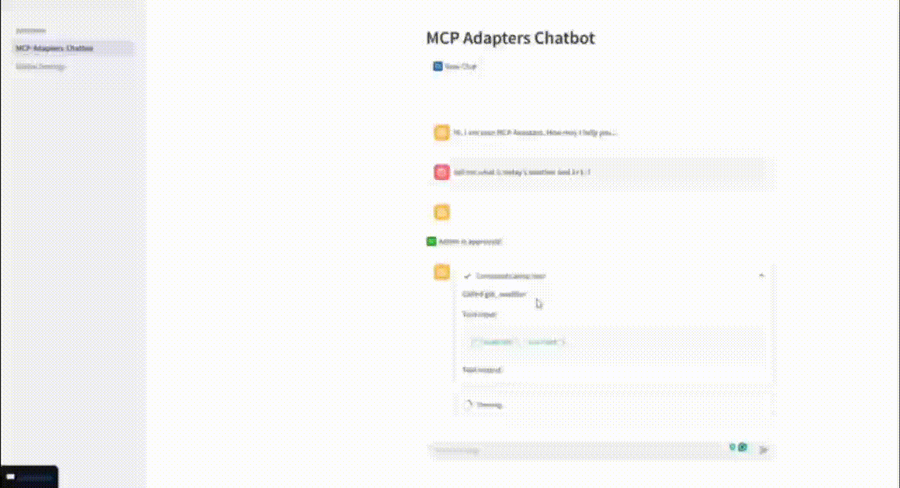

# AIOpStack

[](https://www.python.org/)
[](https://pypi.org/project/langchain/)
[](https://pypi.org/project/langgraph/)
[](https://pypi.org/project/langchain-mcp-adapters/)

---
**5分钟构建您的 AIOps MCP 智能体**

AIOpStack 是一套基于 Langchain/LangGraph 和 Streamlit GUI 的 AI 运维智能体集合，提供运维操作交互和可视化功能。

**Video Demo**



🌐 [English](README.md) | [简体中文](README.zh.md)

### 🎯 设计动机

1. **快速启动** - `DevOps`,`系统管理员`和`开发人员`常需测试多种 MCP 实现自动化，AIOpStack 显著减少学习和配置时间。  
2. **轻量级** - Cursor、VSCode 等 IDE 太过庞大繁琐。AIOpStack 保持极简轻量。  
3. **本地部署** - 支持本地部署以访问私有环境。  
4. **免费开源** - 完全开源，无供应商锁定或授权费用。

### 🚀 主要功能

- **兼容 OpenAI 的大语言模型 API** – 可连接任意兼容 OpenAI API 的 LLM 端点。  
- **MCP 集成** – 实现 LLM 与主流 MCP Server的无缝桥接。  
- **人机协同反馈** – 在关键步骤支持暂停确认或迭代调整。  
- **纯 Python 实现，无需前端技能** – 完全用 Python 编写，便于复用和扩展。

### 应用列表
| Agent Name                     | Description                                                                 | Reference Link                                                                                          |
|--------------------------------|-----------------------------------------------------------------------------|----------------------------------------------------------------------------------------------------------|
| langchain-mcp-adapters-chatbot | 一款基于 langchain-mcp-adapters 的聊天机器人应用，完整继承 Langchain 官方项目的配置。适用于所有 MCP 连接场景。 | [langchain-mcp-adapters](https://github.com/langchain-ai/langchain-mcp-adapters/blob/main/README.md)    |


### 📖 快速开始

#### 环境要求

- Python 3.8 及以上  
- OpenAI 兼容的大模型 API 地址和密钥

#### 安装

```bash
pip install aiopstack
```

#### 使用案例
无参数快速启动：
```bash
aiops
```
项目默认会运行并监听 localhost:8501

#### ⚙️ MCP 设置

> **注意：**  
> 配置必须采用 JSON 格式编写：  
> - **`stdio` 模式**：  
>   - `args` 参数必须使用**绝对路径**  
>   - Windows 路径使用 `\\`，Linux 路径使用 `/`  
>   - 确保所有必需的 **Python 依赖库已预安装**  
> - **`sse` 和 `streamable_http` 模式**：  
>   - 建议使用**完全限定域名 (FQDN)** 或有效 **IP 地址**，避免连接问题  

##### MCP 配置示例  
以下配置对应 [`test_mcp_servers/`](./test_mcp_servers/) 目录中的测试用例：
```json
{
  "math": {
    "command": "python",
    "args": ["C:\\Users\\yfxue\\PycharmProjects\\aiopstack\\test_mcp_server\\math_server.py"],
    "transport": "stdio"
  },
  "weather": {
    "url": "http://192.168.2.103:8000/sse/",
    "transport": "sse"
  }
}
```

**强烈建议**: 参考官方文档 [langchain-mcp-adapters](https://github.com/langchain-ai/langchain-mcp-adapters/blob/main/README.md)

## 🤝 贡献指南

欢迎贡献！如有建议或功能需求，请提交 issue 或 pull request。

### 开发环境配置

1. 克隆仓库：

```bash
git clone https://github.com/hyperaiops/AIOpStack.git
```

2. 安装依赖:

```bash
cd src/aiopstack
pip install -r requirements.txt
```

3. 启动 Streamlit
```bash
streamlit run app.py
```
